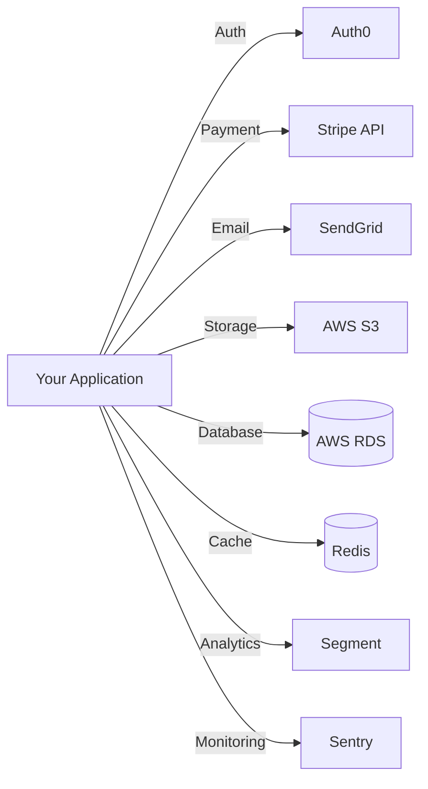

# Generate Dependency Diagram

Generate diagrams showing external service dependencies and integrations.

## What This Does

Analyzes your project to create visualizations of external dependencies:

1. Scans configuration files for external services (APIs, databases, cloud services)
2. Identifies third-party integrations from package dependencies
3. Maps service relationships and data flows
4. Generates Mermaid diagram showing dependency graph
5. Documents authentication and configuration requirements
6. Saves to `docs/dependencies.md`

## Usage

```
/gen-dependency-diagram
```

## Example Output



## Configuration

```yaml
documentation:
  infrastructure:
    dependencies: true  # Set to false to disable
```

---

**Output File**: `docs/dependencies.md`
