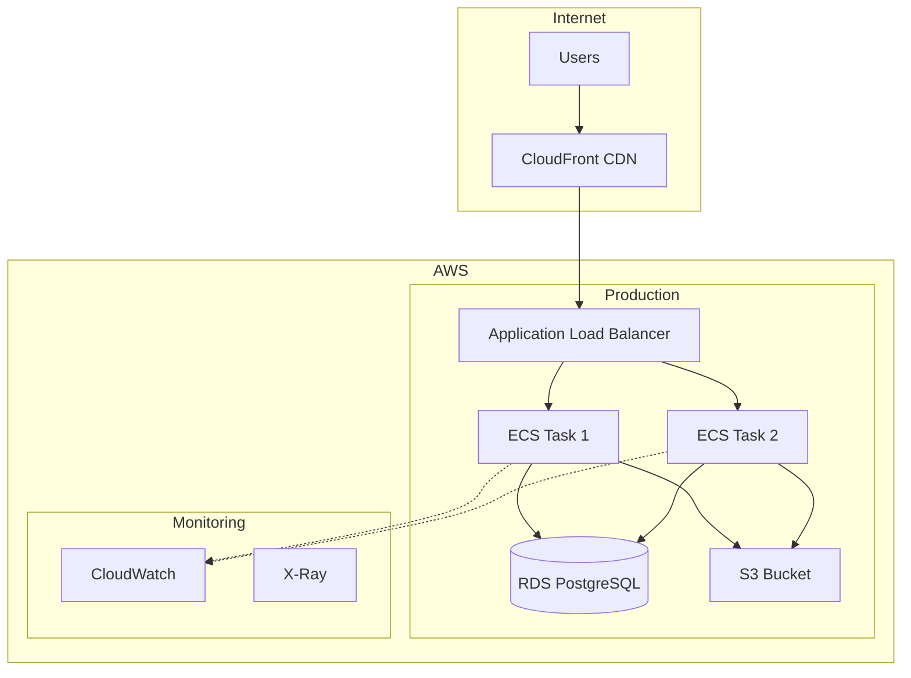

# Generate Deployment Diagram

Generate diagrams showing how your application is deployed across infrastructure.

## What This Does

Analyzes deployment configuration to create infrastructure visualizations:

1. Scans for deployment configs (Dockerfile, docker-compose.yml, k8s manifests, terraform)
2. Identifies infrastructure components (containers, VMs, serverless functions)
3. Maps network architecture and load balancing
4. Documents scaling and redundancy configuration
5. Generates Mermaid deployment diagram
6. Saves to `docs/deployment.md`

## Usage

```
/gen-deployment-diagram
```

## Example Output



## Configuration

```yaml
documentation:
  infrastructure:
    deployment: true  # Set to false to disable

templates:
  deployment: "cloud_native"  # Options: cloud_native, containerized, serverless
```

---

**Output File**: `docs/deployment.md`
