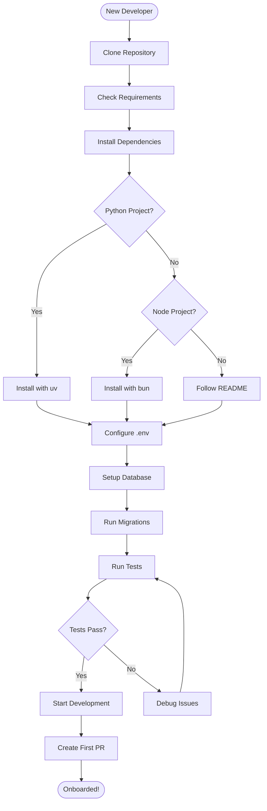

# Generate Onboarding Diagram

Generate visual flowcharts for developer onboarding process.

## What This Does

Creates step-by-step visual guides for onboarding new developers:

1. Analyzes project setup requirements (dependencies, tools, env vars)
2. Identifies setup sequence and dependencies
3. Maps development workflow from clone to first contribution
4. Generates Mermaid flowchart of onboarding steps
5. Integrates with `docs/onboarding.md`

## Usage

```
/gen-onboarding-diagram
```

## Example Output



## Configuration

```yaml
documentation:
  core:
    onboarding: true  # Set to false to disable

templates:
  onboarding: "developer"  # Options: developer, contributor, user
```

---

**Output File**: `docs/onboarding.md` (diagram section)
