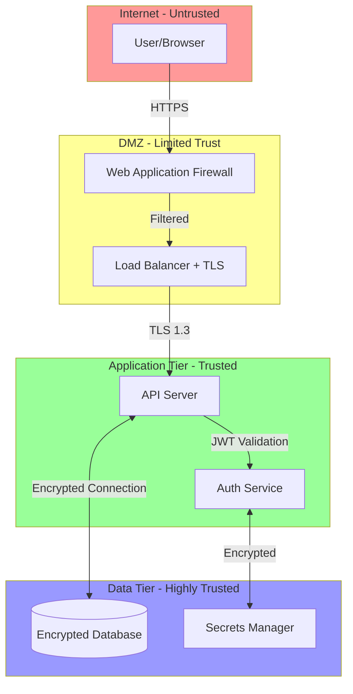

# Generate Security Diagram

Generate diagrams showing security architecture, authentication flows, and data protection.

## What This Does

Analyzes security implementation to create security architecture visualizations:

1. Identifies authentication/authorization mechanisms
2. Maps security boundaries and trust zones
3. Documents data flow with security controls
4. Visualizes encryption (in-transit, at-rest)
5. Shows access control patterns
6. Generates security architecture diagram
7. Saves to `docs/security.md`

## Usage

```
/gen-security-diagram
```

## Example Output



## Security Elements Documented

- Authentication flows (OAuth, JWT, session-based)
- Authorization patterns (RBAC, ABAC)
- Network security (firewalls, VPCs, security groups)
- Data encryption (TLS, encryption at rest)
- Secrets management
- API security (rate limiting, CORS, CSP)
- Audit logging

## Configuration

```yaml
documentation:
  infrastructure:
    security: true  # Set to false to disable
```

---

**Output File**: `docs/security.md`
