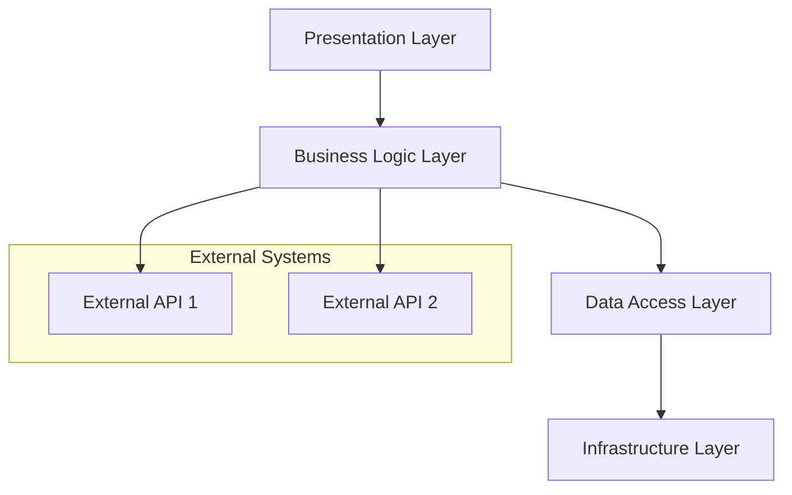

# Enterprise Architecture Overview

## Executive Summary

**Purpose:** [Brief description of what this system does and why it exists]
**Stakeholders:** [Key stakeholders and their roles]
**Scope:** [What is included and excluded from this architecture]

## Business Context

### Business Drivers

- [Key business requirement 1]
- [Key business requirement 2]
- [Key business requirement 3]

### Success Criteria

- [Measurable success metric 1]
- [Measurable success metric 2]
- [Measurable success metric 3]

## Architecture Overview

### High-Level Components

### System Boundaries

- **Internal Systems:** [List of internal systems and their responsibilities]
- **External Dependencies:** [List of external systems and integration points]
- **Data Boundaries:** [Data ownership and access patterns]

## Technical Architecture

### Technology Stack

- **Frontend:** [Technology choices and rationale]
- **Backend:** [Technology choices and rationale]
- **Database:** [Technology choices and rationale]
- **Infrastructure:** [Technology choices and rationale]

### Design Patterns

- **Architectural Pattern:** [e.g., Microservices, Monolithic, Event-Driven]
- **Integration Patterns:** [e.g., REST, GraphQL, Message Queues]
- **Data Patterns:** [e.g., CQRS, Event Sourcing, Repository]

## Quality Attributes

### Performance

- **Response Time:** [SLA requirements]
- **Throughput:** [Expected load and capacity]
- **Scalability:** [Horizontal/vertical scaling approach]

### Security

- **Authentication:** [Authentication strategy]
- **Authorization:** [Authorization model]
- **Data Protection:** [Encryption and privacy measures]

### Reliability

- **Availability:** [Uptime requirements]
- **Disaster Recovery:** [Backup and recovery procedures]
- **Monitoring:** [Observability and alerting strategy]

## Implementation Considerations

### Development Approach

- **Deployment Strategy:** [Blue-green, rolling, canary]
- **CI/CD Pipeline:** [Build, test, and deployment automation]
- **Environment Strategy:** [Development, staging, production environments]

### Risk Assessment

| Risk | Impact | Probability | Mitigation Strategy |
|------|--------|-------------|-------------------|
| [Risk 1] | [High/Medium/Low] | [High/Medium/Low] | [Mitigation approach] |
| [Risk 2] | [High/Medium/Low] | [High/Medium/Low] | [Mitigation approach] |

## Governance

### Decision Authority

- **Architecture Board:** [Composition and responsibilities]
- **Review Process:** [Architecture review and approval process]
- **Standards:** [Coding standards, technology standards]

### Documentation

- **Maintenance:** [How this document will be kept current]
- **Related Documents:** [Links to detailed technical specifications]
- **ADRs:** [Link to Architecture Decision Records]

## Roadmap

### Phase 1: Foundation

- [Milestone 1]
- [Milestone 2]
- [Timeline]

### Phase 2: Enhancement

- [Milestone 1]
- [Milestone 2]
- [Timeline]

### Phase 3: Optimization

- [Milestone 1]
- [Milestone 2]
- [Timeline]

---
**Last Updated:** [Date]
**Version:** 1.0
**Next Review Date:** [Date]
