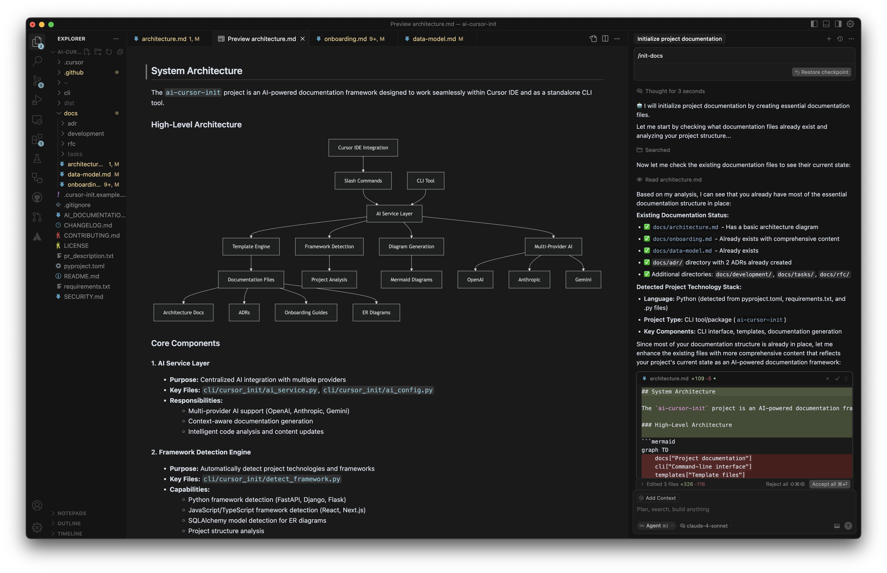
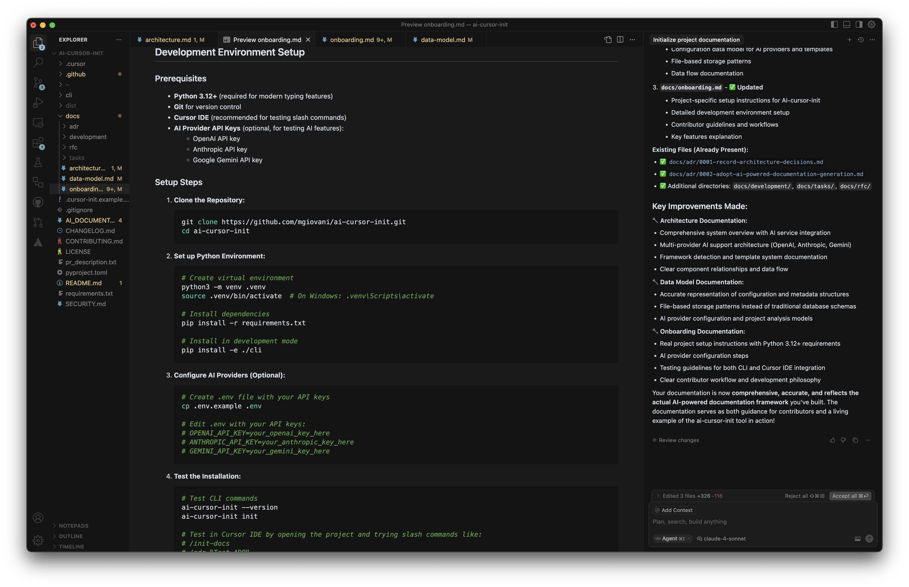
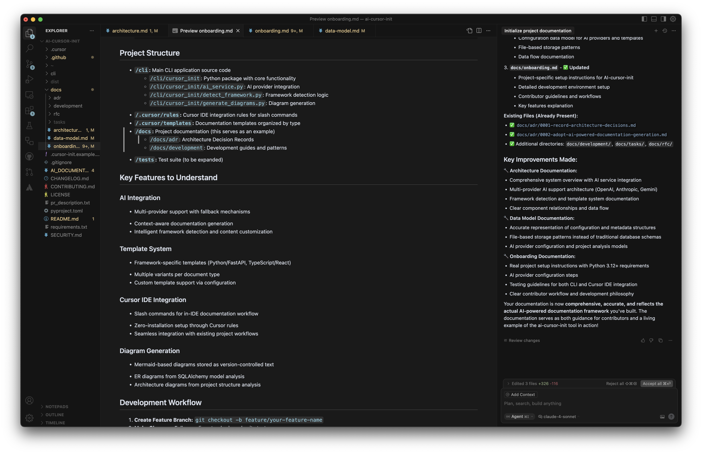
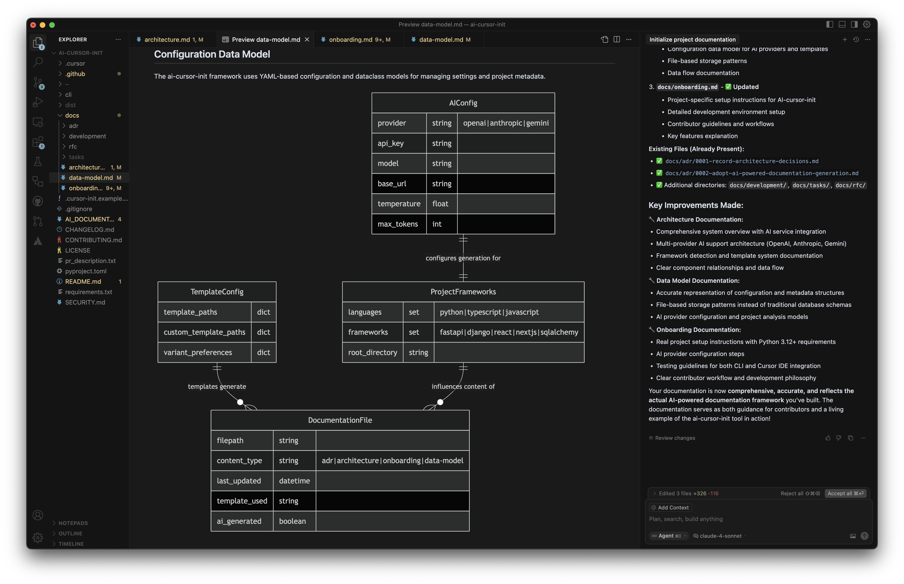

# 🚀 AI Cursor Init

> **Stop writing documentation. Start generating it.**

[](https://opensource.org/licenses/MIT)
[](CHANGELOG.md)
[](CONTRIBUTING.md)

**The AI-powered documentation framework that lives inside your IDE.** Generate Architecture Decision Records, system diagrams, and onboarding guides with simple slash commands. No installations, no setup, no excuses.

---

## ✨ **What Makes This Special?**

🎯 **Zero Installation** → Copy 1 folder, start documenting  
🤖 **AI-Powered** → Analyzes your code to generate contextual docs  
⚡ **Instant Results** → Type `/init-docs` and watch magic happen  
🔄 **Always Fresh** → Docs that sync with your codebase automatically  
🛡️ **Security First** → Static analysis by default, no code execution  

## 🎬 **See It In Action**

```bash
# In Cursor IDE (Chat with Agent Mode), just type:
/init-docs          # 📚 Scaffold complete documentation
```

**Result:** Professional documentation that would take hours to write, generated in seconds.

## 📸 **Visual Showcase**

### 🏗️ System Architecture Documentation

Auto-generated architecture overview with intelligent component mapping:



### 🚀 Onboarding Guide Generation  

Context-aware onboarding documentation tailored to your project:



### 📋 Advanced Onboarding Features

Comprehensive setup guides with framework-specific instructions:



### 🗂️ Data Model Generation

Professional ER diagrams and database schema documentation:



---

## 🎯 **See Real Examples** *(Framework Generated Its Own Docs!)*

**Want to see the quality?** This project uses its own framework! Check out the **[`docs/`](docs/)** folder to see:

- **[📋 Architecture Overview](docs/architecture.md)** - Complete system design with Mermaid diagrams
- **[🚀 Developer Onboarding](docs/onboarding.md)** - Step-by-step setup guide  
- **[🗂️ Data Model](docs/data-model.md)** - Framework structure with ER diagram
- **[📚 API Documentation](docs/api-documentation.md)** - Complete slash command reference
- **[🏛️ Architecture Decisions](docs/adr/)** - 4 ADRs documenting key framework decisions

**Every single document was generated by the framework itself** - that's the power of AI-driven documentation! 🤖✨

---

## 🚀 **Quick Start** *(2 minutes to awesome docs)*

### Zero Configuration *(Recommended)*

```bash
# 1. Clone this repo
git clone https://github.com/mgiovani/ai-cursor-init.git

# 2. Copy framework to your project (ONLY ONE FOLDER!)
cp -r ai-cursor-init/.cursor/ your-project/

# 3. Open your project in Cursor and type:
/init-docs
```

**That's it!** The framework analyzes your project and generates all useful documentation automatically:

- **Always**: Architecture overview, onboarding guide, ADRs
- **If database models found**: ER diagrams, database operations guide  
- **If API endpoints found**: API documentation, security flows
- **If deployment configs found**: Infrastructure and deployment docs
- **If open source/team project**: Contributing guidelines, RFC templates

### Opt-Out Configuration *(Optional)*

Don't want certain documentation? Create `.cursor-init.yaml` to disable specific types:

```yaml
# .cursor-init.yaml (optional - only to disable unwanted docs)
documentation:
  data:
    database_ops: false     # Skip database operations guide
  infrastructure:
    deployment: false       # Skip deployment documentation
    security: false         # Skip security flow diagrams
  development:
    rfc: false             # Skip RFC template setup
```

---

## 🎯 **What You Get**

| Command | What It Does | AI Enhancement | Time Saved |
|---------|-------------|----------------|------------|
| `/init-docs` | Complete documentation scaffold | **Context-aware generation** | **2-3 hours** |
| `/adr "Decision"` | Architecture Decision Record | **Project-specific insights** | **30-45 min** |
| `/gen-er-diagram` | Database schema visualization | **Auto-detection & relationships** | **1-2 hours** |
| `/gen-arch-diagram` | System architecture diagram | **Intelligent component mapping** | **1-2 hours** |
| `/update-docs` | Sync docs with code changes | **Smart content enhancement** | **30-60 min** |
| `/check-docs` | Quality validation & freshness | **Semantic analysis** | **15-30 min** |

**Total time saved per project: 6-10 hours** ⏰

---

## 🏗️ **Generated Documentation Structure**

```
docs/
├── 📋 architecture.md          # System overview & components
├── 🚀 onboarding.md           # Setup guide for new developers  
├── 🗂️ data-model.md           # ER diagrams & database schema
├── adr/                       # Architecture Decision Records
│   ├── 0001-record-architecture-decisions.md
│   ├── 0002-choose-database-technology.md
│   └── 0003-api-authentication-strategy.md
└── rfc/                       # Request for Comments
    ├── new-feature-proposal.md
    └── api-versioning-strategy.md
```

**Every file is:**

- ✅ **Contextual** - Generated from your actual code
- ✅ **Professional** - Follows industry best practices  
- ✅ **Maintainable** - Updates automatically with code changes
- ✅ **Version Controlled** - Markdown files alongside your code

---

## 📋 **Available Commands**

### Documentation Management

- `/init-docs` - Scaffold initial project documentation structure
- `/update-docs` - Analyze and suggest documentation updates
- `/sync-docs` - Sync all documentation with current codebase
- `/sync-doc [name]` - Sync specific documentation file
- `/sync-category [category]` - Sync category (core, data, infrastructure, development)
- `/check-docs` - Validate documentation quality and freshness

### Creation Commands

- `/adr "Decision Title"` - Create Architecture Decision Record
- `/rfc "Proposal Title"` - Create Request For Comments document
- Examples:
  - `/adr "Choose Database Technology"`
  - `/adr lightweight "Quick Decision"` (override template variant)
  - `/rfc "Add GraphQL Support"`

### Diagram Generation

- `/gen-er-diagram` - Generate ER diagrams from database models
- `/gen-arch-diagram` - Generate system architecture diagram
- `/gen-dependency-diagram` - Generate external dependencies diagram
- `/gen-deployment-diagram` - Generate deployment architecture diagram
- `/gen-onboarding-diagram` - Generate developer onboarding flowchart
- `/gen-security-diagram` - Generate security architecture diagram

### Template Management

- `/list-templates` - Show all available templates and variants
- `/add-template [type]` - Add custom template variant

---

## 🎨 **Smart Templates & Auto-Detection**

### **Zero-Config Defaults**

Works immediately with smart detection:

- **Web APIs** → API-focused architecture docs
- **Frontend Applications** → Component-based system diagrams  
- **Database Models** → Detailed ER diagrams with relationships
- **Any Framework** → Framework-appropriate documentation

### **Template Variants**

- **ADRs**: Nygard, MADR, Comprehensive, Lightweight
- **Architecture**: Google Style, Enterprise, Arc42
- **Onboarding**: Developer, Contributor, User
- **Data Model**: Simple, Comprehensive

### **Optional Configuration**

Choose exactly what documentation you need:

```yaml
# .cursor-init.yaml (optional customization)
documentation:
  core:
    architecture: true    # System overview
    onboarding: true     # Developer setup guide
    adr: true           # Architecture decisions
  data:
    data_model: true    # Database schema
    database_ops: false # Performance & operations
    data_security: false # Security policies
  infrastructure:
    deployment: false   # CI/CD & infrastructure
    dependencies: false # External services
    security: false    # Security flows
  development:
    rfc: false         # Request for Comments
    contributing: false # Contribution guides
    api_docs: false    # API documentation
```

### **Common Configurations**

**Startup/Small Team:**

```yaml
documentation:
  core: { architecture: true, onboarding: true, adr: true }
  data: { data_model: true }
  development: { contributing: true }
```

**Enterprise/Large Team:**

```yaml
documentation:
  core: { architecture: true, onboarding: true, adr: true }
  data: { data_model: true, database_ops: true, data_security: true }
  infrastructure: { deployment: true, dependencies: true, security: true }
  development: { rfc: true, contributing: true, api_docs: true }
```

---

## 🛡️ **Security & Trust**

**Safe by Design:**

- 🔒 **Static Analysis Only** - No code execution by default
- 🏖️ **Sandboxed Operations** - Isolated environment for advanced features
- ⏱️ **Resource Limits** - Timeouts and memory constraints
- 🔍 **Transparent Operations** - See exactly what's being analyzed

**Enterprise Ready:**

- ✅ MIT Licensed
- ✅ No external API calls
- ✅ Works offline
- ✅ No data collection

---

## 🔧 **Advanced Features**

### Custom Templates

```bash
/add-template MyTemplate path/to/template.md
/list-templates  # See all available templates
```

### Bulk Operations

```bash
/sync-docs          # Update all documentation
/sync-category adr  # Update only ADRs
```

---

## 🤝 **Contributing**

We're building the future of developer documentation. Join us!

- 🐛 **Found a bug?** [Open an issue](https://github.com/mgiovani/ai-cursor-init/issues)
- 💡 **Have an idea?** [Start a discussion](https://github.com/mgiovani/ai-cursor-init/discussions)
- 🔧 **Want to contribute?** Check our [Contributing Guide](CONTRIBUTING.md)

### Quick Contribution Ideas

- 📝 Add templates for new frameworks (Vue, Angular, Spring Boot)
- 🎨 Create new documentation styles
- 🔧 Improve framework detection logic
- 📚 Write tutorials and examples

---

## 📊 **Project Stats**

- 🏗️ **21 Built-in Templates** across 6 document types
- 🎯 **16 Slash Commands** for instant documentation (native Cursor commands!)
- 🤖 **5 Proactive Rules** for automatic documentation suggestions
- 🔧 **Universal Framework Support** via AI detection
- ⚡ **0 Dependencies** for basic functionality
- 🛡️ **100% Static Analysis** for security

---

## 📄 **License**

MIT License - see [LICENSE](LICENSE) for details.

---

## ⭐ **Star This Repo**

If this tool saved you time, give us a star! It helps other developers discover the project.

[](https://github.com/mgiovani/ai-cursor-init/stargazers)

---

**Built with ❤️ for developers who hate writing docs but love having them.**
