# AI-Cursor-Init Architecture

**Last Updated:** 2025-06-15  
**Project Type:** Documentation Framework & Cursor IDE Integration  
**Current State:** Template-based Documentation Framework

## Overview

The `ai-cursor-init` project is a documentation framework that integrates with Cursor IDE to provide intelligent documentation generation through templates, rules, and AI-powered content creation.

## Current Architecture

```mermaid
graph TD
    A[AI Cursor Init Framework] -->|Contains| B[Cursor Rules]
    A -->|Contains| C[Template System]
    A -->|Contains| D[Documentation Examples]
    A -->|Provides| E[Slash Commands]
    
    B -->|Implements| F["/init-docs"]
    B -->|Implements| G["/update-docs"]
    B -->|Implements| H["/adr"]
    B -->|Implements| I["/gen-er-diagram"]
    B -->|Implements| J["/gen-arch-diagram"]
    B -->|Implements| K["/sync-docs"]
    
    C -->|Architecture| L[Multiple Variants]
    C -->|ADR| M[Multiple Styles]
    C -->|Onboarding| N[Role-based]
    C -->|Data Model| O[Simple/Comprehensive]
    C -->|Security| P[Compliance-focused]
    C -->|Deployment| Q[Infrastructure-aware]
    
    D -->|Examples| R[Live Documentation]
    D -->|Shows| S[Best Practices]
    
    E -->|Integrates| T[Cursor IDE]
    
    style A fill:#f9f,stroke:#333,stroke-width:2px
    style B fill:#bbf,stroke:#333,stroke-width:2px
    style C fill:#bbf,stroke:#333,stroke-width:2px
    style E fill:#bfb,stroke:#333,stroke-width:2px
```

## Core Components

### 1. **Cursor Rules System**

- **Location:** `.cursor/rules/`
- **Purpose:** Defines slash command behavior and AI prompts
- **Key Features:**
  - Template-aware command processing
  - Context gathering from codebase
  - Framework detection logic
  - Multi-provider AI integration prompts

### 2. **Template Library**

- **Location:** `.cursor/templates/`
- **Purpose:** Structured documentation templates with variants
- **Categories:**
  - **Architecture:** Google Style, Enterprise, Arc42
  - **ADR:** Nygard, MADR, Comprehensive, Lightweight  
  - **Onboarding:** Developer, Contributor, User
  - **Data Model:** Simple, Comprehensive
  - **Security:** Data Security, Compliance-focused
  - **Deployment:** Infrastructure-aware templates

### 3. **Configuration System**

- **File:** `.cursor-init.yaml` (configurable)
- **Purpose:** Project-specific customization
- **Features:**
  - Template variant selection
  - Auto-detection settings
  - Quality control parameters
  - Custom template paths

### 4. **Documentation Examples**

- **Location:** `docs/`
- **Purpose:** Living examples of generated documentation
- **Serves as:** Reference implementation and testing ground

## Integration Architecture

### Cursor IDE Integration

- **Mechanism:** Rule-based slash commands
- **Context Awareness:** Automatic project analysis
- **AI Integration:** Multi-provider support through rules
- **Zero Installation:** Works immediately in Cursor IDE

### Framework Detection

- **Method:** File pattern matching and content analysis
- **Supported:** Universal language and framework support via AI analysis
- **Adaptive:** Template selection based on detected stack
- **Extensible:** Configurable detection patterns

### Content Generation Flow

1. **User Triggers:** Slash command in Cursor IDE
2. **Context Analysis:** Project structure and technology detection
3. **Template Selection:** Based on configuration and detection
4. **AI Processing:** Context-aware content generation
5. **File Creation:** Structured markdown output

## Technology Stack

- **Platform:** Cursor IDE Rules & Templates
- **Language:** Markdown with Mermaid diagrams
- **Configuration:** YAML-based settings
- **AI Integration:** Multi-provider through Cursor's AI system
- **Version Control:** Git-friendly text-based documentation

## Design Principles

- **Template-Driven:** Structured, consistent documentation
- **AI-Enhanced:** Intelligent content generation
- **Framework-Aware:** Automatic technology detection
- **Zero-Installation:** Immediate usability in Cursor IDE
- **Living Documentation:** Self-updating examples
- **Industry Standards:** Following documentation best practices

## Current Limitations

- **No CLI Implementation:** Currently Cursor IDE only
- **Template-Based:** Limited to predefined structures  
- **AI Dependency:** Requires Cursor's AI integration
- **Framework Coverage:** Limited to detected patterns

## Future Architecture Considerations

Based on ADRs and development direction:

- Potential standalone CLI implementation
- Extended framework detection
- Custom template authoring tools
- Integration with external documentation systems
- Enhanced diagram generation capabilities

---

*This architecture reflects the current template-based implementation. See ADR documents for architectural decisions and future directions.*
