## System Architecture

The `ai-cursor-init` project is an AI-powered documentation framework designed to work seamlessly within Cursor IDE and as a standalone CLI tool.

### High-Level Architecture

```markdown
# AI Cursor Init Architecture Diagram

This document presents a comprehensive architecture diagram for the AI Cursor Init project. The diagram visualizes the main components of the system, their relationships, data flow, external dependencies, and technology stack.

```mermaid
graph TD
    A[AI Cursor Init] -->|Uses| B[CLI]
    A -->|Depends on| C[Requirements]
    A -->|Includes| D[Documentation]
    A -->|Utilizes| E[External APIs]
    A -->|Configured by| F[Configuration Files]
    
    B -->|Executes| G[Main Script]
    B -->|Interacts with| E
    
    C -->|Contains| H[PyYAML]
    C -->|Contains| I[OpenAI API]
    C -->|Contains| J[Anthropic API]
    C -->|Contains| K[Google Generative AI]
    C -->|Contains| L[Python Dotenv]
    C -->|Contains| M[Rich]
    C -->|Contains| N[TikToken]
    
    F -->|Includes| O[pyproject.toml]
    F -->|Includes| P[requirements.txt]
    F -->|Includes| Q[.cursor-init.yaml]
    
    D -->|Contains| R[README.md]
    D -->|Contains| S[CHANGELOG.md]
    D -->|Contains| T[CONTRIBUTING.md]
    D -->|Contains| U[AI_DOCUMENTATION.md]
    D -->|Contains| V[SECURITY.md]
    D -->|Contains| W[Architecture Docs]
    D -->|Contains| X[Data Model Docs]
    D -->|Contains| Y[Onboarding Docs]

    E -->|Provides| Z[AI Services]
    E -->|Includes| AA[OpenAI]
    E -->|Includes| AB[Anthropic]
    E -->|Includes| AC[Google Generative AI]
    
    style A fill:#f9f,stroke:#333,stroke-width:2px
    style B fill:#bbf,stroke:#333,stroke-width:2px
    style C fill:#bbf,stroke:#333,stroke-width:2px
    style D fill:#bbf,stroke:#333,stroke-width:2px
    style E fill:#bbf,stroke:#333,stroke-width:2px
    style F fill:#bbf,stroke:#333,stroke-width:2px
```



This diagram illustrates the architecture of the AI Cursor Init project, highlighting the key components such as the CLI, external APIs, configuration files, and documentation. Each component is connected to show how they interact and depend on each other, providing a clear overview of the system's structure and functionality.
```

### Core Components

#### 1. **AI Service Layer**

- **Purpose:** Centralized AI integration with multiple providers
- **Key Files:** `cli/cursor_init/ai_service.py`, `cli/cursor_init/ai_config.py`
- **Responsibilities:**
  - Multi-provider AI support (OpenAI, Anthropic, Gemini)
  - Context-aware documentation generation
  - Intelligent code analysis and content updates

#### 2. **Framework Detection Engine**

- **Purpose:** Automatically detect project technologies and frameworks
- **Key Files:** `cli/cursor_init/detect_framework.py`
- **Capabilities:**
  - Python framework detection (FastAPI, Django, Flask)
  - JavaScript/TypeScript framework detection (React, Next.js)
  - SQLAlchemy model detection for ER diagrams
  - Project structure analysis

#### 3. **Template System**

- **Purpose:** Flexible, framework-aware documentation templates
- **Key Files:** Template files in `.cursor/templates/`
- **Features:**
  - Multiple template variants per document type
  - Framework-specific customization
  - AI-powered content generation from templates

#### 4. **Diagram Generation**

- **Purpose:** Automated visual documentation creation
- **Key Files:** `cli/cursor_init/generate_diagrams.py`
- **Outputs:**
  - ER diagrams from SQLAlchemy models
  - Architecture diagrams from project structure
  - Version-controlled Mermaid diagrams

#### 5. **CLI Interface**

- **Purpose:** Command-line tool for CI/CD integration
- **Key Files:** `cli/cursor_init/__main__.py`
- **Commands:**
  - `init` - Initialize documentation structure
  - `update` - AI-powered documentation updates
  - `adr` - Create Architecture Decision Records
  - `check-docs` - Validate documentation freshness

#### 6. **Cursor IDE Integration**

- **Purpose:** Seamless in-IDE documentation workflow
- **Key Files:** Rules in `.cursor/rules/`
- **Slash Commands:**
  - `/init-docs` - Initialize project documentation
  - `/update-docs` - Update existing documentation
  - `/adr "Title"` - Create new ADRs
  - `/gen-er-diagram` - Generate ER diagrams
  - `/gen-arch-diagram` - Generate architecture diagrams

### Data Flow

1. **User Interaction:** Via Cursor slash commands or CLI
2. **Project Analysis:** Framework detection and code analysis
3. **AI Processing:** Context-aware content generation
4. **Template Application:** Framework-specific template selection
5. **Content Generation:** AI-enhanced documentation creation
6. **File Management:** Automated file creation and updates

### Technology Stack

- **Language:** Python 3.12+
- **AI Providers:** OpenAI, Anthropic, Google Gemini
- **Diagram Format:** Mermaid (version-controlled, text-based)
- **Configuration:** YAML-based settings
- **IDE Integration:** Cursor rules and templates
- **Package Management:** pip/setuptools with pyproject.toml

### Design Principles

- **Documentation as Code:** Version-controlled alongside source code
- **AI-Enhanced:** Intelligent content generation and updates
- **Framework-Aware:** Automatic detection and customization
- **Zero-Installation:** Works out-of-the-box in Cursor IDE
- **CI-Friendly:** Automated validation and freshness checks
- **Multi-Provider:** Flexible AI backend support
