# AI-Cursor-Init Architecture

**Last Updated:** 2025-10-23  
**Project Type:** Documentation Framework & Cursor IDE Integration  
**Current State:** Native Commands & Proactive Rules Framework  
**Version:** 1.0.0

## Overview

The `ai-cursor-init` project is a documentation framework that integrates with Cursor IDE to provide intelligent documentation generation through templates, rules, and AI-powered content creation.

## Current Architecture (Post-Migration)

```mermaid
graph TB
    A[AI Cursor Init Framework] -->|Contains| B[Native Commands]
    A -->|Contains| C[Proactive Rules]
    A -->|Contains| D[Template System]
    A -->|Contains| E[Documentation Examples]

    B -->|User Actions| F[Documentation Management]
    B -->|User Actions| G[Creation Commands]
    B -->|User Actions| H[Diagram Generation]
    B -->|User Actions| I[Template Management]

    F -->|Commands| F1["/init-docs"]
    F -->|Commands| F2["/update-docs"]
    F -->|Commands| F3["/sync-docs"]
    F -->|Commands| F4["/check-docs"]

    G -->|Commands| G1["/adr"]
    G -->|Commands| G2["/rfc"]

    H -->|Commands| H1["/gen-er-diagram"]
    H -->|Commands| H2["/gen-arch-diagram"]
    H -->|Commands| H3["6 diagram types"]

    I -->|Commands| I1["/list-templates"]
    I -->|Commands| I2["/add-template"]

    C -->|Always-On| J[Context Rules]
    C -->|Always-On| K[Quality Rules]
    C -->|Always-On| L[Proactive Suggestions]

    J -->|Provides| J1["Framework Docs"]
    K -->|Enforces| K1["DRY, SOLID"]
    L -->|Monitors| L1["Code Changes"]
    L1 -->|Suggests| L2["Doc Updates"]

    D -->|Template Variants| M[ADR: 4 styles]
    D -->|Template Variants| N[Architecture: 3 styles]
    D -->|Template Variants| O[RFC: 3 styles]
    D -->|Template Variants| P[Onboarding: 3 styles]

    E -->|Examples| Q[Live Documentation]
    E -->|Shows| R[Best Practices]

    B -.->|Uses| D
    C -.->|References| D

    style A fill:#f9f,stroke:#333,stroke-width:2px
    style B fill:#9f9,stroke:#333,stroke-width:2px
    style C fill:#99f,stroke:#333,stroke-width:2px
    style D fill:#ff9,stroke:#333,stroke-width:2px
```

## Core Components

### 1. **Native Cursor Commands System** (New!)

- **Location:** `.cursor/commands/cursor-init/`
- **Format:** Plain Markdown files (no frontmatter required)
- **Purpose:** User-invoked slash commands
- **Command Categories:**
  - **Documentation Management (6)**: init-docs, update-docs, sync-docs, sync-doc, sync-category, check-docs
  - **Creation Commands (2)**: adr, rfc
  - **Diagram Generation (6)**: gen-er-diagram, gen-arch-diagram, gen-dependency-diagram, gen-deployment-diagram, gen-onboarding-diagram, gen-security-diagram
  - **Template Management (2)**: list-templates, add-template
- **Key Features:**
  - Appears in Cursor's `/` autocomplete menu
  - Plain Markdown instructional format
  - Parameter override support (e.g., `/adr lightweight "Title"`)
  - Configuration-aware execution

### 2. **Always-On Rules System**

- **Location:** `.cursor/rules/cursor-init/`
- **Format:** MDC files with frontmatter
- **Purpose:** Proactive guidance and context injection
- **Rule Categories:**
  - **Context Rules (3)**: docs-context, adr-context, architecture-context
  - **Quality Rules (1)**: code-quality
  - **Proactive Rules (1)**: proactive-doc-suggest
- **Key Features:**
  - `alwaysApply: true` for continuous monitoring
  - Automatically suggests documentation updates after code changes
  - Provides framework context when users ask questions
  - Enforces code quality standards (DRY, SOLID)

### 3. **Template Library**

- **Location:** `.cursor/cursor-init/templates/` (migrated from `.cursor/templates/`)
- **Purpose:** Structured documentation templates with multiple variants
- **Categories:**
  - **Architecture (3):** Google Style, Enterprise, Arc42
  - **ADR (4):** Nygard, MADR, Full, Lightweight
  - **RFC (3):** Minimal, Standard, Detailed
  - **Onboarding (3):** Developer, Contributor, User
  - **Data Model (2):** Simple, Comprehensive
  - **Diagrams:** ER, Component, Deployment, Security, etc.

### 4. **Configuration System**

- **File:** `.cursor-init.yaml` (optional)
- **Purpose:** Project-specific customization with opt-out behavior
- **Features:**
  - Template variant selection (project-wide defaults)
  - Per-command parameter override support
  - Documentation opt-out settings (explicit `false` to disable)
  - Custom template paths
  - Auto-detection preferences

### 5. **Documentation Examples**

- **Location:** `docs/`
- **Purpose:** Living examples of generated documentation
- **Serves as:** Reference implementation, testing ground, and self-documentation

## Integration Architecture

### Cursor IDE Integration

- **Commands:** Native slash commands via `.cursor/commands/`
- **Rules:** Always-on MDC rules via `.cursor/rules/`
- **Context Awareness:** Automatic project analysis
- **AI Integration:** Cursor's AI processes command instructions
- **Zero Installation:** Works immediately in Cursor IDE
- **Auto-Discovery:** Commands appear in `/` autocomplete
- **Proactive Behavior:** Rules monitor changes and suggest actions

### Framework Detection

- **Method:** File pattern matching and content analysis
- **Supported:** Universal language and framework support via AI analysis
- **Adaptive:** Template selection based on detected stack
- **Extensible:** Configurable detection patterns

### Content Generation Flow

#### User-Initiated (Commands)
1. **User Triggers:** Types slash command in Cursor IDE (e.g., `/init-docs`)
2. **Command Loading:** Cursor loads plain Markdown command file
3. **Instruction Processing:** AI reads command instructions
4. **Configuration Check:** Reads `.cursor-init.yaml` for settings
5. **Context Analysis:** Project structure and technology detection
6. **Template Selection:** Based on configuration, detection, and parameters
7. **AI Processing:** Context-aware content generation following instructions
8. **File Creation:** Structured markdown output

#### Proactive (Rules)
1. **Continuous Monitoring:** Always-on rules track codebase changes
2. **Change Detection:** Identifies modifications to models, APIs, etc.
3. **Relevance Analysis:** Determines if changes affect documentation
4. **Suggestion Generation:** Proposes specific slash commands to run
5. **User Notification:** Suggests updates at appropriate times

## Technology Stack

- **Platform:** Cursor IDE Rules & Templates
- **Language:** Markdown with Mermaid diagrams
- **Configuration:** YAML-based settings
- **AI Integration:** Multi-provider through Cursor's AI system
- **Version Control:** Git-friendly text-based documentation

## Design Principles

- **Template-Driven:** Structured, consistent documentation
- **AI-Enhanced:** Intelligent content generation
- **Framework-Aware:** Automatic technology detection
- **Zero-Installation:** Immediate usability in Cursor IDE
- **Living Documentation:** Self-updating examples
- **Industry Standards:** Following documentation best practices

## Current Limitations

- **No CLI Implementation:** Cursor IDE only (deliberate choice per ADR-0004)
- **Template-Based:** Limited to predefined structures
- **AI Dependency:** Requires Cursor's AI integration
- **Framework Coverage:** Limited to detected patterns
- **Two Systems:** Requires understanding both commands and rules

## Architecture Evolution

### Recent Migration (October 2025)

**From:** MDC-based rules (21 files in `.cursor/rules/`)
**To:** Hybrid architecture (16 native commands + 5 proactive rules)

See **ADR-0005** for complete migration rationale and details.

### Benefits Achieved

- ✅ Better integration with Cursor's native command system
- ✅ Commands appear in `/` autocomplete automatically
- ✅ Clearer separation: user actions vs proactive guidance
- ✅ Simpler command format (plain Markdown)
- ✅ Proactive documentation suggestions via always-on rules
- ✅ Parameter override support for template flexibility
- ✅ Future-proof alignment with Cursor's roadmap

### Future Architecture Considerations

Based on ADRs and development direction:

- Extended framework detection algorithms
- Additional template variants for specialized domains
- Custom template authoring UI/tools
- Integration with external documentation systems
- Enhanced diagram generation capabilities
- More sophisticated proactive suggestion logic

---

*This architecture reflects the current template-based implementation. See ADR documents for architectural decisions and future directions.*
