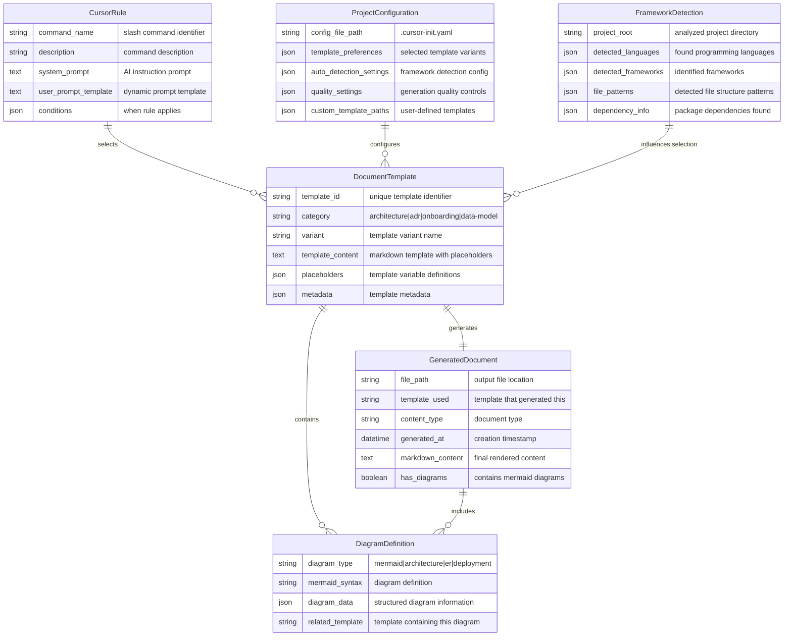

# AI-Cursor-Init Framework Data Model

**Last Updated:** 2025-06-15  
**Current Architecture:** Template & Rule-based Framework  
**Integration:** Cursor IDE Native

This document describes the data structures and models used by the AI-powered cursor-init framework.

## Framework Architecture

The ai-cursor-init framework follows a template-driven architecture where documentation is generated through structured templates and Cursor IDE rules, rather than direct AI service integration.



## Key Components

### Template System

- **Multi-Variant Templates**: Each document type has multiple template variants
- **Placeholder-Based**: Uses `{{PLACEHOLDER}}` syntax for dynamic content
- **Framework-Aware**: Templates adapt based on detected project technology
- **Extensible**: Support for custom templates via configuration

### Cursor Rule Integration

- **Slash Commands**: Mapped to specific documentation generation workflows
- **Context Gathering**: Rules collect project information for AI processing
- **Dynamic Prompts**: Context-aware prompts sent to Cursor's AI system
- **Template Selection**: Rules choose appropriate templates based on project state

### Configuration Management

- **YAML-Based**: Human-readable configuration files
- **Template Preferences**: User selection of template variants
- **Auto-Detection**: Configurable framework and pattern detection
- **Quality Controls**: Generation quality and validation settings

## Data Flow

### 1. Command Trigger Phase

```
User Types Slash Command → Cursor Rule Activated → Context Analysis Begins
```

### 2. Project Analysis Phase

```
File System Scan → Framework Detection → Dependency Analysis → Context Building
```

### 3. Template Selection Phase

```
Project Context + Configuration → Template Variant Selection → Placeholder Preparation
```

### 4. AI Generation Phase

```
Template + Context + System Prompt → Cursor AI Processing → Content Generation
```

### 5. Document Creation Phase

```
Generated Content → Template Rendering → File Writing → Documentation Output
```

## Template Categories

### Core Documentation Templates

| Category | Variants | Purpose |
|----------|----------|---------|
| **Architecture** | Google Style, Enterprise, Arc42 | System design documentation |
| **ADR** | Nygard, MADR, Comprehensive, Lightweight | Architecture decisions |
| **Onboarding** | Developer, Contributor, User | Project setup guides |
| **Data Model** | Simple, Comprehensive | Database schema documentation |

### Specialized Templates

| Category | Variants | Purpose |
|----------|----------|---------|
| **Security** | Data Security, Compliance | Security policies |
| **Deployment** | Infrastructure-focused | Deployment guides |
| **Operations** | Database Operations | Operational procedures |
| **Development** | Contributing Guidelines | Development workflow |

## Configuration Schema

### Template Configuration

```yaml
templates:
  adr: "nygard_style"           # nygard_style|full|lightweight|madr
  architecture: "google_style"  # google_style|enterprise|arc42
  onboarding: "developer"       # developer|contributor|user
  data_model: "comprehensive"   # simple|comprehensive
```

### Generation Settings

```yaml
generation:
  analysis_depth: "standard"     # basic|standard|comprehensive
  include_code_examples: true
  auto_generate_toc: true
  include_diagrams: true
  
  quality:
    min_content_length: 500
    max_retries: 3
    validate_generation: true
```

## Diagram Integration

### Mermaid Diagram Types

- **Architecture Diagrams**: System component relationships
- **ER Diagrams**: Database schema visualization  
- **Deployment Diagrams**: Infrastructure and deployment flows
- **Security Diagrams**: Authentication and authorization flows
- **Dependency Diagrams**: External service relationships

### Diagram Generation Process

1. **Template Analysis**: Identify diagram requirements in templates
2. **Data Extraction**: Extract relevant project information
3. **Mermaid Synthesis**: Generate valid Mermaid syntax
4. **Template Integration**: Embed diagrams in documentation templates
5. **Validation**: Ensure diagram syntax is correct

## Quality Assurance

### Template Validation

- **Placeholder Consistency**: Ensure all placeholders are properly defined
- **Markdown Validity**: Validate generated markdown syntax
- **Diagram Syntax**: Verify Mermaid diagram correctness
- **Content Completeness**: Check for minimum content requirements

### Framework Accuracy

- **Detection Precision**: Accurate technology stack identification
- **Template Matching**: Appropriate template selection for project type
- **Context Relevance**: Generated content matches project reality
- **Consistency**: Maintain consistent terminology across documents

## Extension Points

### Custom Templates

```yaml
custom_template_paths:
  - name: "MyCustomArchitecture"
    path: "./templates/custom-arch.md"
    category: "architecture"
```

This template-driven architecture enables consistent, high-quality documentation generation while maintaining flexibility and extensibility for diverse project types.
