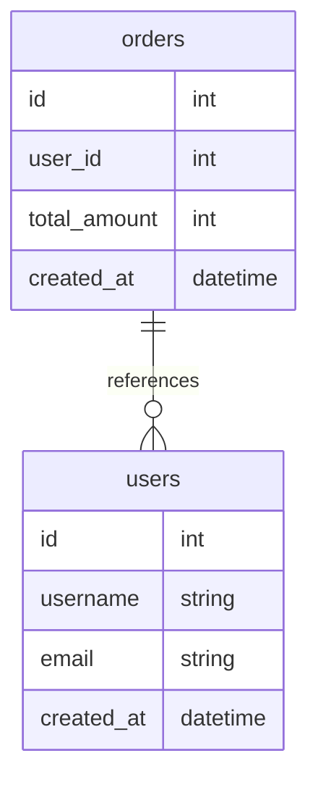

# Project Data Model

This document contains the Entity Relationship Diagram (ERD) for the project's data model.

```mermaid
erDiagram
    users {
        id int
        username string
        email string
        created_at datetime
    }
    orders {
        id int
        user_id int
        total_amount int
        created_at datetime
    }
    orders ||--o{ users : references
```
