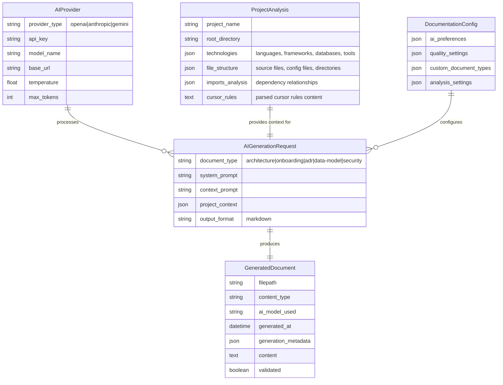

# AI-Cursor-Init Data Model

This document describes the data structures and models used by the AI-powered cursor-init framework.

## Core Architecture

The ai-cursor-init framework follows an AI-first architecture where all documentation is generated through intelligent analysis of your codebase, rather than static templates.



## Key Components

### AI Provider Integration

- **Multi-Provider Support**: OpenAI GPT, Anthropic Claude, Google Gemini
- **Dynamic Model Selection**: Automatically selects best available model
- **Error Handling**: Graceful fallbacks and retry mechanisms
- **Rate Limiting**: Built-in request throttling and quota management

### Intelligent Project Analysis

- **Language Detection**: Automatic detection of all programming languages
- **Framework Recognition**: Identifies frameworks without hardcoded limitations
- **Dependency Analysis**: Analyzes imports and dependencies across languages
- **Structural Understanding**: Maps project architecture and component relationships

### Context-Aware Generation

- **Cursor Rules Integration**: Leverages project-specific rules and guidelines
- **Codebase Analysis**: Deep understanding of project structure and patterns
- **Technology-Specific**: Tailored documentation for each tech stack
- **Evolutionary**: Adapts to changes in codebase over time

## Data Flow

### 1. Project Discovery Phase

```
Project Root → File Scanner → Technology Detector → Dependency Analyzer
                                     ↓
                            Project Analysis Object
```

### 2. Context Enrichment Phase

```
Project Analysis + Cursor Rules + User Preferences → AI Context Builder
                                     ↓
                            Enriched Generation Context
```

### 3. AI Generation Phase

```
Context + Document Type + AI Provider → AI Generation Engine
                                     ↓
                            Generated Documentation
```

### 4. Validation & Output Phase

```
Generated Content → Quality Validator → File Writer → Documentation
```

## Configuration Schema

### AI Configuration

```yaml
ai:
  preferred_provider: "anthropic"  # openai|anthropic|gemini
  providers:
    openai:
      model: "o3"
      temperature: 0.1
      max_tokens: 4000
    anthropic:
      model: "claude-sonnet-4"
      temperature: 0.1
      max_tokens: 4000
    gemini:
      model: "gemini-2.5-pro"
      temperature: 0.1
      max_tokens: 4000
```

### Generation Settings

```yaml
generation:
  analysis_depth: "comprehensive"  # basic|standard|comprehensive
  include_code_examples: true
  auto_generate_toc: true
  quality:
    min_content_length: 500
    max_retries: 3
    validate_generation: true
```

## Technology Detection Capabilities

### Supported Languages & Frameworks

The AI system automatically detects and generates appropriate documentation for:

**Languages:** Python, TypeScript, JavaScript, Go, Rust, Java, C++, C, PHP, Ruby, Kotlin, Swift, C#, Scala, Clojure

**Python Frameworks:** FastAPI, Django, Flask, SQLAlchemy, Pydantic, Celery, Pytest

**JavaScript/TypeScript:** React, Next.js, Vue.js, Angular, Express.js, NestJS, Svelte

**Databases:** PostgreSQL, MySQL, MongoDB, Redis, SQLite, Cassandra, DynamoDB

**Tools:** Docker, Kubernetes, GitHub Actions, Jenkins, Terraform, Ansible

**Architecture Patterns:** Microservices, Monolith, Serverless, Event-Driven, CQRS

## Quality Assurance

### Content Validation

- **Relevance Scoring**: AI-generated content relevance to project context
- **Completeness Checks**: Ensures all required sections are present
- **Technical Accuracy**: Validates technical information against project reality
- **Consistency Verification**: Maintains consistent terminology and style

### Continuous Improvement

- **Feedback Loop**: User feedback improves future generations
- **Pattern Learning**: AI learns from successful documentation patterns
- **Context Evolution**: Adapts to changing project requirements
- **Quality Metrics**: Tracks and improves generation quality over time

## Security & Privacy

### Code Analysis Safety

- **Static Analysis Only**: No code execution or dynamic imports
- **Sandboxed Processing**: Isolated analysis environment
- **Data Minimization**: Only processes necessary code patterns
- **Local Processing**: Analysis happens locally, only prompts sent to AI

### API Key Management

- **Environment Variables**: Secure storage of API credentials
- **Local Configuration**: Project-specific settings stored locally
- **No Credential Sharing**: API keys never included in generated content
- **Rotation Support**: Easy credential rotation and provider switching

## Extension Points

### Custom Document Types

```python
def generate_security_docs(self, project_root: str = '.') -> str:
    context = self._analyze_project_structure(project_root)
    system_prompt = "You are a security expert..."
    return self.ai_service.generate_content(system_prompt, context)
```

### Custom Analysis

```python
def _detect_custom_framework(self, config_contents: Dict[str, str]) -> bool:
    # Custom framework detection logic
    return 'custom-framework' in str(config_contents).lower()
```

### Custom Validation

```python
def validate_custom_content(self, content: str) -> bool:
    # Custom validation logic
    return len(content) > 100 and 'required_keyword' in content
```

This AI-first data model enables limitless extensibility while maintaining high-quality, contextually relevant documentation generation for any technology stack.
