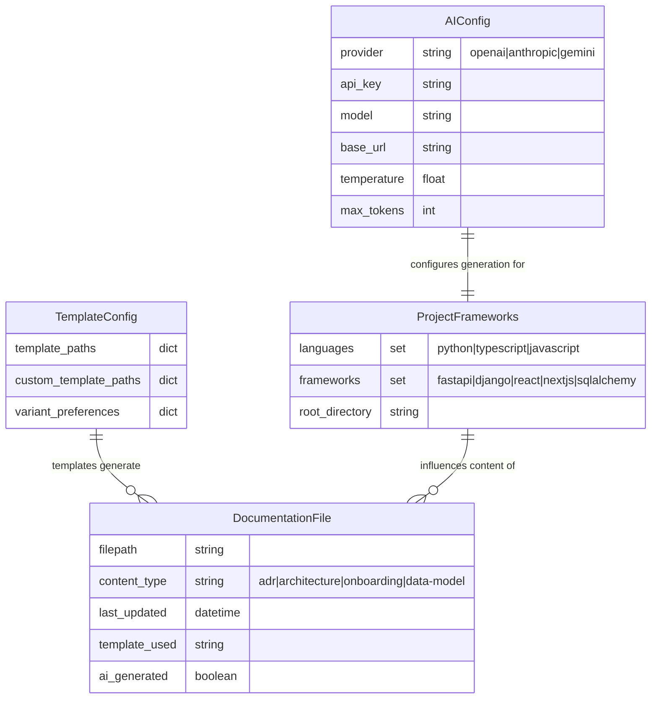

# Project Data Model

This document describes the data structures and configuration models used by the AI-cursor-init framework.

## Configuration Data Model

The ai-cursor-init framework uses YAML-based configuration and dataclass models for managing settings and project metadata.

## Key Data Structures

### AI Provider Configuration

- **Purpose:** Manages multi-provider AI integration settings
- **Location:** Stored in project-local `.ai-cursor-init.yaml` or user config
- **Supported Providers:** OpenAI, Anthropic Claude, Google Gemini

### Framework Detection Results  

- **Purpose:** Stores detected project technologies and frameworks
- **Usage:** Influences template selection and content generation
- **Detection Sources:** File analysis, dependency scanning, structure patterns

### Template Metadata

- **Purpose:** Maps document types to available templates and variants
- **Customization:** Supports custom template paths and user preferences
- **Inheritance:** Default templates can be overridden by project-specific ones

### Documentation Tracking

- **Purpose:** Maintains metadata about generated documentation files
- **Features:** Tracks AI generation status, template usage, and freshness
- **Integration:** Used by `/check-docs` for validation and staleness detection

## File-Based Data Storage

This project primarily uses file-based storage rather than traditional databases:

- **Configuration Files:** YAML format for settings and preferences
- **Documentation Files:** Markdown format with embedded Mermaid diagrams  
- **Template Files:** Jinja2-style templates with framework-specific variants
- **Metadata:** Embedded in file headers and configuration sections

## Data Flow Pattern

1. **Configuration Loading:** Read user/project AI and template settings
2. **Project Analysis:** Scan codebase to detect frameworks and structure  
3. **Template Selection:** Choose appropriate templates based on detected frameworks
4. **AI Context Building:** Aggregate project information for AI providers
5. **Content Generation:** Generate documentation using AI + templates
6. **File Management:** Write/update documentation files with metadata tracking
