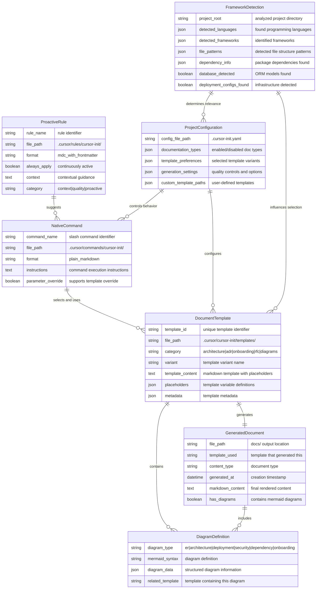

# AI-Cursor-Init Framework Data Model

**Last Updated:** 2025-10-23  
**Current Architecture:** Native Commands & Proactive Rules Framework  
**Integration:** Cursor IDE Native  
**Version:** 1.0.0

This document describes the data structures and models used by the AI-powered cursor-init framework.

## Framework Architecture

The ai-cursor-init framework follows a hybrid architecture with native Cursor commands and proactive rules. Documentation is generated through structured templates, with commands providing user-invoked actions and rules providing always-on context and guidance.



## Key Components

### Template System

- **Multi-Variant Templates**: Each document type has multiple template variants
- **Placeholder-Based**: Uses `{{PLACEHOLDER}}` syntax for dynamic content
- **Framework-Aware**: Templates adapt based on detected project technology
- **Extensible**: Support for custom templates via configuration

### Native Commands & Rules Integration

**Native Commands** (`.cursor/commands/cursor-init/`):
- **User-Invoked Actions**: Appear in `/` autocomplete menu (16 commands)
- **Plain Markdown Format**: No frontmatter required
- **Parameter Override**: Support template variant override (e.g., `/adr lightweight "Title"`)
- **Template Selection**: Choose appropriate templates based on configuration

**Proactive Rules** (`.cursor/rules/cursor-init/`):
- **Always-On Guidance**: Continuous monitoring and suggestions (5 rules)
- **MDC Format**: Markdown with frontmatter (`alwaysApply: true`)
- **Context Injection**: Provide framework knowledge on demand
- **Quality Enforcement**: Enforce code quality standards (DRY, SOLID)
- **Proactive Suggestions**: Suggest documentation updates after code changes

### Configuration Management

- **YAML-Based**: Human-readable configuration files
- **Template Preferences**: User selection of template variants
- **Auto-Detection**: Configurable framework and pattern detection
- **Quality Controls**: Generation quality and validation settings

## Data Flow

### 1. Command Trigger Phase

```
User Types Slash Command → Cursor Rule Activated → Context Analysis Begins
```

### 2. Project Analysis Phase

```
File System Scan → Framework Detection → Dependency Analysis → Context Building
```

### 3. Template Selection Phase

```
Project Context + Configuration → Template Variant Selection → Placeholder Preparation
```

### 4. AI Generation Phase

```
Template + Context + System Prompt → Cursor AI Processing → Content Generation
```

### 5. Document Creation Phase

```
Generated Content → Template Rendering → File Writing → Documentation Output
```

## Template Categories

### Core Documentation Templates (21 Total)

| Category | Variants | Count | Purpose |
|----------|----------|-------|---------|
| **Architecture** | Google Style, Enterprise, Arc42 | 3 | System design documentation |
| **ADR** | Nygard, Full, Lightweight, MADR | 4 | Architecture decisions |
| **Onboarding** | Developer, Contributor, User | 3 | Project setup guides |
| **RFC** | Minimal, Standard, Detailed | 3 | Feature proposals |
| **Data Model** | Simple, Comprehensive, ER Diagram, Component Diagram | 4 | Database schema documentation |

### Specialized Templates

| Category | Templates | Purpose |
|----------|-----------|---------|
| **Security** | Data Security | Security policies |
| **Deployment** | Deployment Guide | Infrastructure deployment |
| **Dependencies** | Dependencies Documentation | External services |
| **Operations** | Database Operations | Operational procedures |

## Configuration Schema

### Template Configuration

```yaml
templates:
  adr: "nygard_style"           # nygard_style|full|lightweight|madr
  architecture: "google_style"  # google_style|enterprise|arc42
  onboarding: "contributor"     # developer|contributor|user
  data_model: "comprehensive"   # simple|comprehensive
  rfc: "standard"               # minimal|standard|detailed
```

### Generation Settings

```yaml
generation:
  analysis_depth: "standard"     # basic|standard|comprehensive
  include_code_examples: true
  auto_generate_toc: true
  include_diagrams: true
  
  quality:
    min_content_length: 500
    max_retries: 3
    validate_generation: true
```

## Diagram Integration

### Mermaid Diagram Types (6 Commands)

- **Architecture Diagrams** (`/gen-arch-diagram`): System component relationships
- **ER Diagrams** (`/gen-er-diagram`): Database schema visualization  
- **Deployment Diagrams** (`/gen-deployment-diagram`): Infrastructure and deployment flows
- **Security Diagrams** (`/gen-security-diagram`): Authentication and authorization flows
- **Dependency Diagrams** (`/gen-dependency-diagram`): External service relationships
- **Onboarding Diagrams** (`/gen-onboarding-diagram`): Developer setup flowcharts

### Diagram Generation Process

1. **Template Analysis**: Identify diagram requirements in templates
2. **Data Extraction**: Extract relevant project information
3. **Mermaid Synthesis**: Generate valid Mermaid syntax
4. **Template Integration**: Embed diagrams in documentation templates
5. **Validation**: Ensure diagram syntax is correct

## Quality Assurance

### Template Validation

- **Placeholder Consistency**: Ensure all placeholders are properly defined
- **Markdown Validity**: Validate generated markdown syntax
- **Diagram Syntax**: Verify Mermaid diagram correctness
- **Content Completeness**: Check for minimum content requirements

### Framework Accuracy

- **Detection Precision**: Accurate technology stack identification
- **Template Matching**: Appropriate template selection for project type
- **Context Relevance**: Generated content matches project reality
- **Consistency**: Maintain consistent terminology across documents

## Extension Points

### Custom Templates

```yaml
custom_template_paths:
  - name: "MyCustomArchitecture"
    path: "./templates/custom-arch.md"
    category: "architecture"
```

## Framework Statistics

- **16 Native Commands**: User-invoked documentation actions
  - 6 Documentation Management commands
  - 2 Creation commands (ADR, RFC)
  - 6 Diagram generation commands
  - 2 Template management commands
- **5 Proactive Rules**: Always-on guidance
  - 3 Context rules (docs, ADR, architecture)
  - 1 Quality rule (code quality standards)
  - 1 Proactive rule (documentation suggestions)
- **21 Templates**: Multiple variants per document type
- **Zero External Dependencies**: Pure Cursor IDE integration

This hybrid architecture (native commands + proactive rules) enables consistent, high-quality documentation generation while maintaining flexibility and extensibility for diverse project types.
